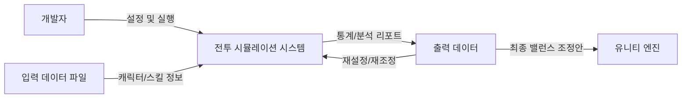

# 4 vs N 턴제 전투 시스템 밸런스 시뮬레이터 기획서

## 1.Business Purpose

### 1) Project Background
밸런스 시스템은 게임에 있어 굉장히 중요한 시스템입니다.  
전투의 난이도가 제작자의 의도와 다르게 너무 어렵거나 쉬우면 제작자가 전하고자 하는 바가 제대로 전해지지 않을 수 있으며,
플레이어의 플레이 스타일 고착화, 공략 불가능으로 인한 불쾌감 유발 등 여러 문제가 발생할 수 있습니다.  
4 vs 4 (+@) 전투 시스템은 캐릭터 간의 스킬 조합, 시너지, 상태 이상 효과 등 수많은 변수가 실시간으로 상호작용하는 복잡한 구조를 가지고 있습니다.  
이처럼 변수가 많은 시스템에서는 제작자의 직관에만 의존하여 밸런싱을 진행하기에 명확한 한계가 존재하며, 시스템이 복잡해질수록 수치상의 작은 차이가 게임 전체의 승률에 큰 영향을 미치게 됩니다.

### 2) Motivation
기존의 유니티 엔진 환경에서 직접 플레이하며 수치를 조정하는 방식은 필요없는 그래픽 리소스와 물리 엔진 연산 등의 개입으로 인해 반복적인 테스트 속도가 매우 느리다는 단점이 있습니다.  
다수의 전투 데이터를 확보해야 하는 밸런싱 작업의 특성상, 이러한 비효율은 전체적인 개발 속도를 저하시키는 원인이 됩니다.  
따라서 게임의 그래픽 요소를 배제하고 순수하게 전투 로직만을 분리하여, 가볍고 빠르게 실행할 수 있는 파이썬 기반의 시뮬레이터를 직접 구축하기로 결정하였습니다.  

### 3) Goal
본 프로젝트의 가장 큰 목표는 단기간에 다수의 전투 데이터를 생성하여 객관적인 통계 지표를 확보하는 것입니다.  
구체적으로는 플레이어의 승률, 전투 종료 시의 잔여 HP 비율, 전투 턴 수, 공/수 스킬 선택 비율 등의 핵심 지표를 데이터화하여 전투의 난이도를 제작자
이를 통해 정교한 수치 조정 근거를 마련하고, 데이터 중심의 의사결정 프로세스를 구축하는 것을 최종 목표로 삼고 있습니다.  

### 4) Target Market
본 시뮬레이터의 일차적인 타겟은 게임 개발 과정에서 수치 조정과 밸런스 검증을 진행하는 제작자입니다.  
또한, 전투 로직 내의 논리적 오류를 사전에 점검해야 하는 QA 단계에서도 효율적인 도구로 활용될 수 있습니다.  
더 나아가 다른 형태의 전투가 도입되어 있는 게임의 밸런스를 조정하는 프로그램의 개발의 참고 자료로써 활용될 수 있습니다.  

---

## 2. 시스템 컨텍스트 다이어그램 (System Context Diagram)

---

## 3. Use Case List

### 1) 입력 데이터 설정
* **Actor:** 밸런스 기획자
* **Description:** 기획자는 각 유닛에 대한 정보(이름, 진영, HP 등)와 스킬에 대한 정보(스킬 유형, 수치 등), 그리고 전투 환경에 대한 정보(크리티컬 확률, 크리티컬 대미지 등)가 저장된 밸런스 설정용 파일을 입력 파일로 설정합니다.

### 2) 전투 유닛 설정
* **Actor:** 제작자
* **Description:** 제작자는 플레이어 및 적 진영의 유닛을 설정하여 시뮬레이션 대상을 지정합니다.

### 3) 각 유닛별 사용 가능 스킬 리스트 설정
* **Actor:** 제작자
* **Description:** 제작자는 각 유닛이 보유할 수 있는 스킬의 개수(정수)와 해당 스킬들을 지정하여, 전투 중에 유닛이 사용할 수 있는 스킬의 범위를 설정합니다.

### 4) 시뮬레이션 목표 설정
* **Actor:** 제작자
* **Description:** 한 번에 시행할 시뮬레이션 횟수(시행 묶음), 플레이어측 캐릭터들이 전투 중에 유지하고자 하는 잔여 HP의 비율, 플레이어 측 캐릭터의 사망 허가 여부, 공/수 스킬 사용 비율 등의 목표 수치를 설정합니다.

### 5) 시뮬레이션 실행
* **Actor:** 제작자
* **Description:** 시뮬레이션 실행 버튼을 눌러 이전에 설정한 환경에서의 시뮬레이션을 수행합니다.

### 6) 시뮬레이션 회차별 결과 확인
* **Actor:** 제작자
* **Description:** 각 시뮬레이션 회차의 로그를 출력하여 결과를 확인합니다.  
  기본적으로는 회차당 한 줄씩 요약된 로그(n회차, 소모 턴 수, 플레이어 승패 여부, 잔여 HP 비율, 사망한 플레이어 캐릭터 수, 처치한 적 유닛 수, 공/수 스킬 사용 비율)를 출력합니다.  
  사용자가 상세 내용을 확인하고자 하는 행을 클릭하면 해당 로그가 펼쳐지며 상세 정보(공격 타입 스킬 사용 횟수, 수비 타입 스킬 사용 횟수, 크리티컬 공격 발생 횟수 등)를 출력합니다.  
  상세 내용이 출력된 로그를 다시 한번 클릭하면 요약된 상태로 복구됩니다.  

### 7) 시뮬레이션 결과의 통계 출력 및 외부 파일 저장
* **Actor:** 제작자
* **Description:** 시행 묶음 데이터의 통계를 화면에 출력하여 결과를 한눈에 파악하기 쉽도록 합니다.  
  여기에는 플레이어 승률, 목표 잔여 HP 달성 비율, 플레이어 캐릭터 사망 비율, 크리티컬 발생 비율, 목표 공/수 스킬 사용 비율의 달성도 등이 포함됩니다.  
  또한 분석된 데이터를 외부 파일로 저장하여 관리할 수 있습니다.  

---

## 4. Describe how to operate the use cases

### 1) 입력 데이터 설정 (Input Data Setup)
* **Purpose**
  전투 시뮬레이션의 기초가 되는 캐릭터, 스킬, 환경 변수 데이터를 시스템에 로드하기 위함입니다.
* **Approach**
  사전에 정의된 규격(CSV, JSON 등)에 맞춰 작성된 밸런스 설정 파일을 시뮬레이터에 입력하면, 시스템은 이를 파싱하여 내부 데이터 모델로 변환합니다.
* **Dynamics**
  시뮬레이션 환경 구축의 첫 단계에서 실행 파일과 설정 데이터가 연결될 때 수행됩니다.
* **Goals**
  전투 로직 계산에 필요한 모든 수치 데이터를 오류 없이 시스템에 확보하는 것을 목표로 합니다.

### 2) 전투 유닛 설정 (Combat Unit Setup)
* **Purpose**
  테스트하고자 하는 특정 전투 상황의 아군(Player)과 적군(Enemy) 진영의 구성을 정의하기 위함입니다.
* **Approach**
  로드된 유닛 목록 중에서 시뮬레이션에 참여할 유닛들을 진영별로 선택하고 배치하여 전투 대상을 확정합니다.
* **Dynamics**
  입력 데이터 로드가 완료된 후, 구체적인 전투 시나리오를 구성하는 단계에서 수행됩니다.
* **Goals**
  시뮬레이션의 대상이 되는 유닛 조합을 명확히 설정합니다.

### 3) 각 유닛별 사용 가능 스킬 리스트 설정 (Skill List Setup)
* **Purpose**
  각 캐릭터가 전투 중에 사용할 수 있는 액션의 범위를 기획 의도에 맞게 제한하고 구성하기 위함입니다.
* **Approach**
  유닛별로 보유 가능한 스킬의 개수를 지정하고, 사용 가능한 전체 스킬 풀에서 특정 스킬들을 선택하여 유닛에게 할당합니다.
* **Dynamics**
  전투 유닛 구성이 완료된 후, 각 캐릭터의 성능과 역할을 세부적으로 정의할 때 수행됩니다.
* **Goals**
  유닛별 스킬 셋(Skill Set) 구성을 완료하여 전투 행동 패턴의 기초를 마련합니다.

### 4) 시뮬레이션 목표 설정 (Simulation Goal Setup)
* **Purpose**
  대량의 전투 데이터를 통해 검증하고자 하는 정량적 목표치와 실행 환경을 정의하기 위함입니다.
* **Approach**
  반복 시행 횟수(시행 묶음)를 지정하고, 목표 잔여 HP 비율, 캐릭터 사망 허용 여부, 공/수 스킬 사용 가중치 등 밸런스 판단의 기준이 될 수치를 입력합니다.
* **Dynamics**
  실제 시뮬레이션 연산을 시작하기 직전, 데이터 분석의 가이드라인을 설정할 때 수행됩니다.
* **Goals**
  데이터 분석의 기준점이 될 목표 지표를 설정하고 통계적 유의성을 확보할 수 있는 실행 횟수를 결정합니다.

### 5) 시뮬레이션 실행 (Simulation Execution)
* **Purpose**
  설정된 논리적 조건 하에서 수많은 전투를 반복 수행하여 검증용 데이터를 생성하기 위함입니다.
* **Approach**
  시뮬레이션 실행 명령을 호출하여 그래픽 연산을 배제한 순수 로직 기반의 전투 연산을 고속으로 수행합니다.
* **Dynamics**
  모든 환경 및 목표 설정이 완료된 상태에서 최종적인 데이터를 확보하기 위해 수행됩니다.
* **Goals**
  단시간 내에 제작자가 의도한 횟수만큼의 전투 결과 데이터를 산출하는 것을 목표로 합니다.

### 6) 시뮬레이션 회차별 결과 확인 (Result Verification per Session)
* **Purpose**
  개별 전투 회차에서 발생한 세부 로그를 분석하여 전투 흐름의 타당성과 논리적 오류를 검토하기 위함입니다.
* **Approach**
  전체 회차의 요약 리스트 중 특정 회차를 클릭하여 상세 전투 로그를 펼쳐보고, 스킬 사용 순서나 크리티컬 발생 여부 등의 세부 데이터를 확인한 뒤 다시 접습니다.
* **Dynamics**
  시뮬레이션 종료 후, 특정 변수가 전투 결과에 미친 영향을 정밀하게 추적할 때 수행됩니다.
* **Goals**
  개별 전투 시퀀스의 논리적 무결성을 확인하고 특이 수치가 발생한 원인을 파악합니다.

### 7) 시뮬레이션 결과의 통계 출력 및 외부 파일 저장 (Statistics and Export)
* **Purpose**
  시행된 모든 데이터를 종합하여 객관적인 밸런스 지표를 도출하고 이를 기록하기 위함입니다.
* **Approach**
  수집된 전체 데이터를 승률, 목표 달성률 등으로 통계화하여 화면에 시각화하고, 추가 분석을 위해 외부 파일로 내보냅니다.
* **Dynamics**
  모든 시뮬레이션 과정이 완료되고 최종적인 밸런스 조정안을 결정해야 할 때 수행됩니다.
* **Goals**
  객관적인 통계 리포트를 생성하고, 유니티 엔진 반영을 위한 데이터 중심의 근거 자료를 확보합니다.

---

  ## 5. Problem Statement

### 1) 조합 폭발에 따른 시뮬레이션 케이스 관리 (Combinatorial Explosion)
4 vs N 전투 시스템은 캐릭터 조합, 스킬 선택, 상태 이상 중첩 등 변수가 기하급수적으로 많습니다.  
모든 경우의 수를 테스트하는 것은 물리적으로 불가능하므로, 유의미한 표본 데이터를 추출하기 위한 시뮬레이션 횟수 설정과 데이터 샘플링 기법에 대한 깊은 고려가 필요합니다.

### 2) 행동 결정 알고리즘의 타당성 확보 (AI Behavior Modeling)
제작자가 원하던 공/수 스킬 사용 비율, 목표 잔여 HP 등의 달성도를 유지하면서도 적은 턴 수로 전투를 끝내는 AI 로직 구축이 요구됩니다.

### 3) 성능 및 효율성 (Performance & Efficiency)
* **High-Speed Execution:** 그래픽 리소스를 배제한 만큼, 다수의 전투 연산을 짧은 시간 내로 완료하여 게임 제작 과정에서의 피드백 루프 과정을 최소화해야 합니다.
* **Low Resource Usage:** 백그라운드에서 실행 시에도 CPU 및 메모리 점유율을 최적화하여 다른 개발 도구(Unity, Visual Studio 등)와의 병행 작업에 지장이 없어야 합니다.

### 4) 사용성 및 편의성 (Usability)
* **Data-Driven Configuration:** 소스 코드 수정 없이 외부 파일(CSV, JSON) 수정 후 변경 내용을 '새로고침' 혹은 '파일 재지정'과 같은 버튼으로 캐릭터의 스탯이나 스킬 수치를 즉각 변경하고 테스트할 수 있어야 합니다.
* **Intuitive Logging:** 방대한 데이터 중 제작자가 필요한 정보(특이 지점, 목표 수치 달성 실패 구간 등)를 시각적으로 쉽게 식별할 수 있는 로그 구조를 제공해야 합니다.

### 5) 신뢰성 및 정확성 (Reliability & Accuracy)
* **Deterministic Results:** 동일한 설정과 시행횟수를 설정했을 때, 각 수치들이 비슷한 값으로 수렴해야 합니다.
* **Error Handling:** 입력 데이터 파일의 형식이 잘못되었을 경우, 시스템이 충돌하지 않고 사용자에게 정확한 오류 위치와 내용을 안내해야 합니다.

### 6) 유지보수성 및 확장성 (Maintainability & Scalability)
* **Modular Design:** 향후 유니티의 전투 로직이 변경될 경우, 시뮬레이터의 핵심 연산 모듈만 교체하여 신속하게 대응할 수 있는 구조를 유지해야 합니다.
* **Scalable Architecture:** 4 vs 4 전투뿐만 아니라 1 vs N, N vs M 등 다양한 전투 규모 확장에 유연하게 대처할 수 있도록 설계해야 합니다.

---

  ## 6. Glosary

### 1) 제작자
* 게임 개발팀의 인원을 의미하며 주로 기획자, 개발자를 지칭하지만 팀의 인원수, 프로젝트 규모 등에 따라 QA와 같은 직군도 대상이 될 수 있습니다.
* 소규모의 팀일수록 직군이 겹칠 것을 감안하여 제작자라 표현하였습니다.

### 2) Unity
* C#을 언어로 채택하는 게임 개발 엔진입니다.

### 3) 4 vs 4(+@) , 4 vs N
* 최대 4 vs 4 환경의 전투를 기준으로 전투 환경을 가정하지만,
  적 유닛의 기믹 혹은 스토리 연출 상의 의도된 적의 증원 등을 상황을 가정하여 플레이어와 전투하는 적 유닛의 수가 4를 초과화는 경우를 고려하여 표현한 것입니다.

---

  ## 7. References

### 1) Unity
 * https://unity.com/kr
 * https://docs.unity.com/ko-kr
 * https://learn.unity.com/tutorial/start-learning-unity
