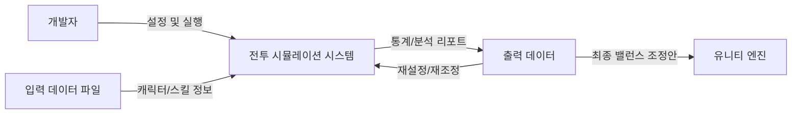

# 4 vs N 턴제 전투 시스템 밸런스 시뮬레이터 기획서

## 1.Business Purpose

### 1) Project Background
밸런스 시스템은 게임에 있어 굉장히 중요한 시스템입니다.  
전투의 난이도가 기획자, 개발자(이하 제작자)의 의도와 다르게 너무 어렵거나 쉬우면 제작자가 전하고자 하는 바가 제대로 전해지지 않을 수 있으며,
플레이어의 플레이 스타일 고착화, 공략 불가능으로 인한 불쾌감 유발 등 여러 문제가 발생할 수 있습니다.  
4 vs 4 (+@) 전투 시스템은 캐릭터 간의 스킬 조합, 시너지, 상태 이상 효과 등 수많은 변수가 실시간으로 상호작용하는 복잡한 구조를 가지고 있습니다.  
이처럼 변수가 많은 시스템에서는 제작자의 직관에만 의존하여 밸런싱을 진행하기에 명확한 한계가 존재하며, 시스템이 복잡해질수록 수치상의 작은 차이가 게임 전체의 승률에 큰 영향을 미치게 됩니다.

### 2) Motivation
기존의 유니티 엔진 환경에서 직접 플레이하며 수치를 조정하는 방식은 필요없는 그래픽 리소스와 물리 엔진 연산 등의 개입으로 인해 반복적인 테스트 속도가 매우 느리다는 단점이 있습니다.  
다수의 전투 데이터를 확보해야 하는 밸런싱 작업의 특성상, 이러한 비효율은 전체적인 개발 속도를 저하시키는 원인이 됩니다.  
따라서 게임의 그래픽 요소를 배제하고 순수하게 전투 로직만을 분리하여, 가볍고 빠르게 실행할 수 있는 파이썬 기반의 시뮬레이터를 직접 구축하기로 결정하였습니다.  

### 3) Goal
본 프로젝트의 가장 큰 목표는 단기간에 다수의 전투 데이터를 생성하여 객관적인 통계 지표를 확보하는 것입니다.  
구체적으로는 플레이어의 승률, 전투 종료 시의 잔여 HP 비율, 전투 턴 수, 공/수 스킬 선택 비율 등의 핵심 지표를 데이터화하여 전투의 난이도를 제작자
이를 통해 정교한 수치 조정 근거를 마련하고, 데이터 중심의 의사결정 프로세스를 구축하는 것을 최종 목표로 삼고 있습니다.  

### 4) Target Market
본 시뮬레이터의 일차적인 타겟은 게임 개발 과정에서 수치 조정과 밸런스 검증을 진행하는 기획자 혹은 개발자입니다.  
또한, 전투 로직 내의 논리적 오류를 사전에 점검해야 하는 QA 단계에서도 효율적인 도구로 활용될 수 있습니다.  
더 나아가 다른 형태의 전투가 도입되어 있는 게임의 밸런스를 조정하는 프로그램의 개발의 참고 자료로써 활용될 수 있습니다.  

---

## 2. 시스템 컨텍스트 다이어그램 (System Context Diagram)

---

## 3. Use Case List

### 1) 입력 데이터 설정
* **Actor:** 밸런스 기획자
* **Description:** 기획자는 각 유닛에 대한 정보(이름, 진영, HP 등)와 스킬에 대한 정보(스킬 유형, 수치 등), 그리고 전투 환경에 대한 정보(크리티컬 확률, 크리티컬 대미지 등)가 저장된 밸런스 설정용 파일을 입력 파일로 설정합니다.

### 2) 전투 유닛 설정
* **Actor:** 밸런스 기획자
* **Description:** 기획자는 플레이어 및 적 진영의 유닛을 설정하여 시뮬레이션 대상을 지정합니다.

### 3) 각 유닛별 사용 가능 스킬 리스트 설정
* **Actor:** 밸런스 기획자
* **Description:** 밸런스 기획자는 각 유닛이 보유할 수 있는 스킬의 개수(정수)와 해당 스킬들을 지정하여, 전투 중에 유닛이 사용할 수 있는 스킬의 범위를 설정합니다.

### 4) 시뮬레이션 목표 설정
* **Actor:** 밸런스 기획자
* **Description:** 한 번에 시행할 시뮬레이션 횟수(시행 묶음), 플레이어측 캐릭터들이 전투 중에 유지하고자 하는 잔여 HP의 비율, 플레이어 측 캐릭터의 사망 허가 여부, 공/수 스킬 사용 비율 등의 목표 수치를 설정합니다.

### 5) 시뮬레이션 실행
* **Actor:** 밸런스 기획자
* **Description:** 시뮬레이션 실행 버튼을 눌러 이전에 설정한 환경에서의 시뮬레이션을 수행합니다.

### 6) 시뮬레이션 회차별 결과 확인
* **Actor:** 밸런스 기획자
* **Description:** 각 시뮬레이션 회차의 로그를 출력하여 결과를 확인합니다.  
  기본적으로는 회차당 한 줄씩 요약된 로그(n회차, 소모 턴 수, 플레이어 승패 여부, 잔여 HP 비율, 사망한 플레이어 캐릭터 수, 처치한 적 유닛 수, 공/수 스킬 사용 비율)를 출력합니다.  
  사용자가 상세 내용을 확인하고자 하는 행을 클릭하면 해당 로그가 펼쳐지며 상세 정보(공격 타입 스킬 사용 횟수, 수비 타입 스킬 사용 횟수, 크리티컬 공격 발생 횟수 등)를 출력합니다.  
  상세 내용이 출력된 로그를 다시 한번 클릭하면 요약된 상태로 복구됩니다.  

### 7) 시뮬레이션 결과의 통계 출력 및 외부 파일 저장
* **Actor:** 밸런스 기획자
* **Description:** 시행 묶음 데이터의 통계를 화면에 출력하여 결과를 한눈에 파악하기 쉽도록 합니다.  
  여기에는 플레이어 승률, 목표 잔여 HP 달성 비율, 플레이어 캐릭터 사망 비율, 크리티컬 발생 비율, 목표 공/수 스킬 사용 비율의 달성도 등이 포함됩니다.  
  또한 분석된 데이터를 외부 파일로 저장하여 관리할 수 있습니다.  
